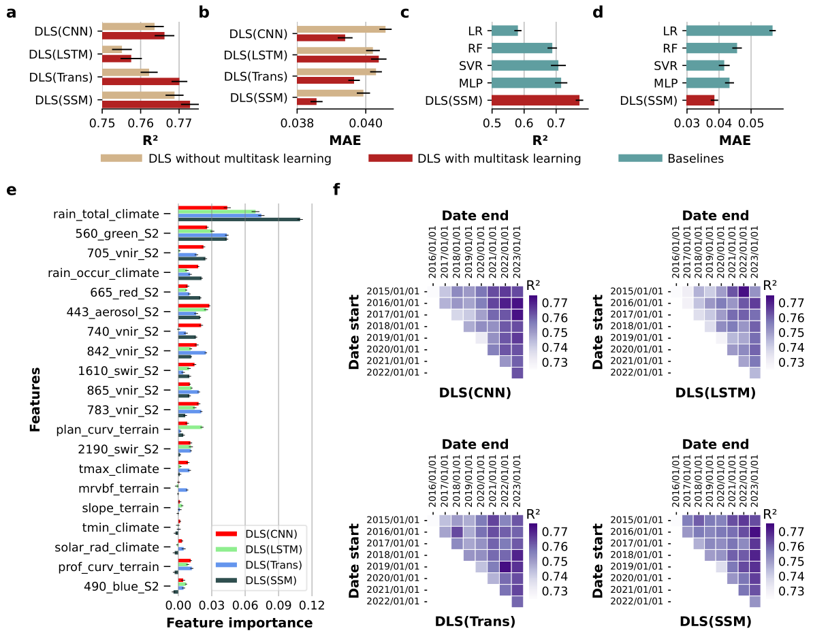

# DLSoc
 Deep Learning- based SOC estimation framework (DLS). 
 
 
 This framework leverages deep learning techniques including time-series encoders like LSTM, Transformer, mamber, and multitask learning mechanism to handle regional SOC variation. Details can be found in the paper (paper will be publically available soon).
## Requirements
- Pytorch 
- Mamba
- Cuda which can speed up the training process
## Usage
**Example Usage**

    $python run.py

Hyper parameters can be set in the argparse in the run.py

## Results

## Scripts
**./data_provider**

Preprocess the raw data including time series and static features to be ready for the model input

**./dataset**

Raw data
- All_S2_bands. Sentinel2 records for the training samples'locations
- climate. Climate data
- terrain. Static terrain features

**./exp**

Functions to train the model

**./layers and ./models**

Functions for different deep learning models' layer

**/utils**

Functions like attentive fusion, evaluation metrics, etc. 
