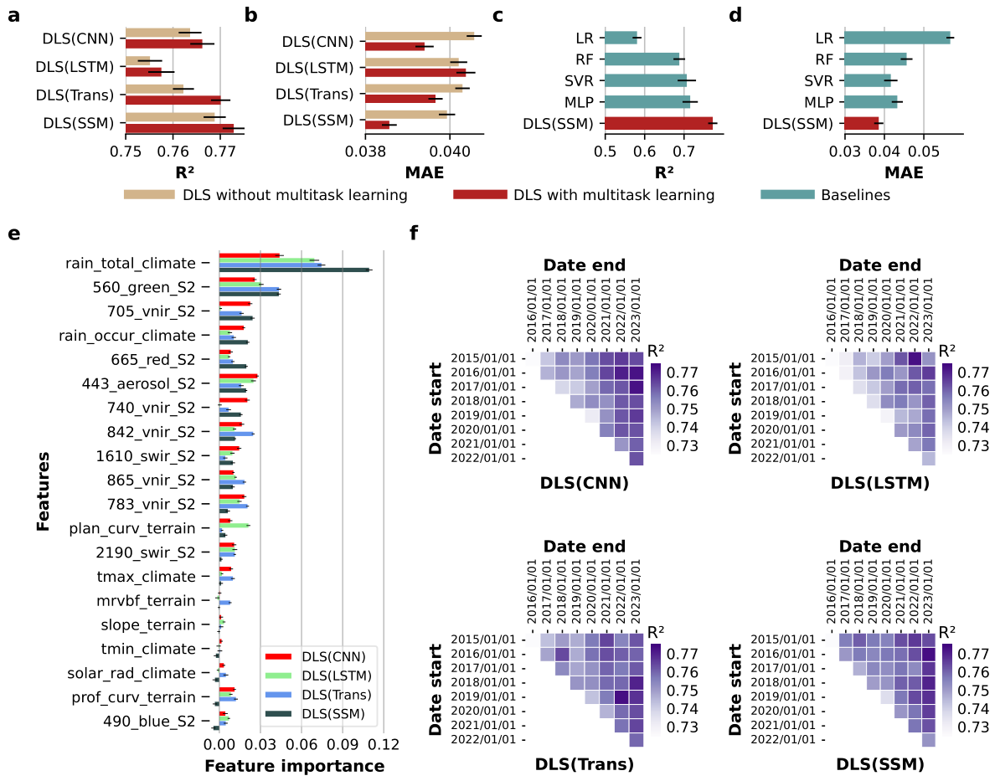

# DNNS
Deep Neural Network framework with multitask learning for large-scale SOC estimation. 
 
 
The framework employs a time-series encoder (e.g., CNN, RNN, Transformer, or SSM) to process remote sensing and climate time-series data, alongside a static learner implemented as a fully connected feedforward network to process terrain attributes. The learned representations from both modules are integrated via an attention-based fusion mechanism, which adaptively weights their relative contributions based on predictive relevance. The fused representation is then passed into a multitask learning module comprising shared layers (trained on all samples to capture common characteristics across all regions) and task-specific layers (trained on regional subsets to preserve distinctive local patterns). This architecture enables end-to-end training of DNNS to estimate SOC that are both globally informed and locally precise.).
## Requirements
- Pytorch==2.8.0 
- transformers==5.5.0
- Cuda which can speed up the training process
- More details can be found in requirements.txt
## Usage
**Example Usage**

    $python run.py

Hyper parameters can be set in the argparse in the run.py

## Results

## Scripts
**./data_provider**

Preprocess the raw data including time series and static features to be ready for the model input

**./dataset**

Raw data
- All_S2_bands. Sentinel2 records for the training samples'locations
- climate. Climate data
- terrain. Static terrain features

**./exp**

Functions to train the model

**./layers and ./models**

Functions for different deep learning models' layer

**./utils**

Functions like attentive fusion, evaluation metrics, etc. 
